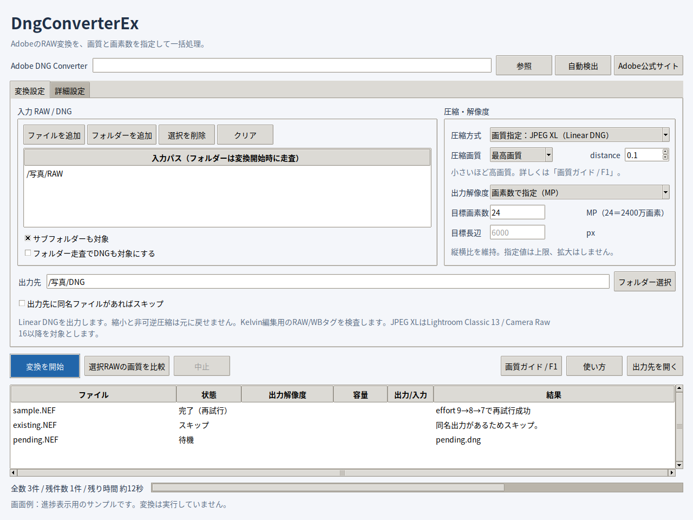

# DngConverterEx

RAWを圧縮DNGへ一括変換するPython GUIです。変換にはインストール済みの **Adobe DNG Converter** を使います。Lightroomへの取り込みは手動です。



*実際のGUIに模擬進捗を表示した画面例です。画像変換は実行していません。*

## 起動

Python 3.10以降・Tkinterと、[Adobe DNG Converter](https://helpx.adobe.com/camera-raw/desktop/dng-and-file-formats/adobe-dng-converter.html)を用意してください。JPEG XLにはAdobe DNG Converter 16以降を使います。変換の対象OSはWindows / macOSです。

最初に、このフォルダーで依存パッケージをインストールします。

| OS | インストール | 起動 |
|---|---|---|
| Windows | `py -3 -m pip install .` | `launch_windows.cmd` をダブルクリック |
| macOS | `python3 -m pip install .` | `bash launch_macos.command` |

優先度・CPU使用率の制御にはpsutilを使用します。WindowsのEXEを作る場合は `build_windows_exe.cmd` を実行してください。

## 使い方

1. RAWファイルまたはフォルダーを追加。
2. 出力先・圧縮方式・画質・出力解像度を選択。
3. 必要なら、変換設定の出力先欄の下にある「出力先に同名ファイルがあればスキップ」をON。
4. 「変換を開始」。出力DNGをLightroomへ手動で取り込み。

| 設定・表示 | 内容 |
|---|---|
| JPEG XL distance | 小さいほど高画質。明暗の編集耐性を優先する比較開始値は0.1〜0.2 |
| JPEG XL effort | 大きいほど時間をかけて圧縮。初期値は7 |
| 出力解像度 | 原寸・MP・長辺。縦横比を維持し、指定値を上限として縮小 |
| 既存出力のスキップ | ONで既存ファイルを保持して次へ進む。初期状態はOFF |
| スキップOFF時の同名処理 | 詳細設定で連番付加／上書きを選択。初期値は連番付加 |
| 全数・残件数 | プログレスバーの横に表示。スキップ・失敗も処理済みとして数える |
| 残り時間 | 終了した変換の平均時間から推定。最初は「計算中」。再試行時間を含め、予定スキップを除外 |
| プロセス優先度 | 詳細設定で通常／低め／最低を選択 |
| CPU上限（目安） | 詳細設定で1〜100%。PC全論理CPUに対する変換プロセスと子プロセスの平均使用率。100%は制限なし |

CPU制御は一時停止・再開で平均使用率を調整します。瞬間的には上限を超える場合があります。画質・解像度は変えませんが、変換時間は長くなります。待機時間もファイルの制限時間に含まれます。

設定は次回起動時にも復元します。入力RAWは変更・削除しません。出力先には変換結果のJSONLレポートを保存します。

## 画質とLightroom

「**画質ガイド / F1**」で、distance・effort、ハイライト／シャドウの編集耐性、Adobeの設定、Lightroomでの確認方法を読めます。

画質指定JPEG XLは**非可逆のLinear DNG**です。元RAWと同じ情報量を保持するものではありません。原寸のRAW情報を優先する場合は、ロスレスJPEG圧縮DNGを選んでください。

カラーRAWではKelvin編集に必要なWB・カラーメタデータを検査します。JPEG XLはLightroom Classic 13 / Camera Raw 16以降を対象にします。実Adobeでの機種別変換・画質・Lightroom操作は実機未検証です。

## JPEG XLのassert対策

対象は、Adobeの異常終了と、同じ行の `enc_ans.cc`・`JXL_DASSERT`・`n <= 255` が一致した場合です。

| 詳細設定 | 動作 |
|---|---|
| 自動再試行（初期ON） | effort 9→8→7、または8→7。成功した時点で終了。distance・解像度は維持 |
| ロスレスJPEGへの代替出力（初期OFF） | 原寸時だけ、対象assertが残る場合に元RAWから変換方式を変更 |

各試行は別プロセス・一時フォルダーを使い、中止と制限時間は全試行で共有します。再試行しても全数・残件数は増えません。Adobe内蔵版で同じ不具合か、回避できるかは未確認です。

## CLI・テスト

```bash
python app.py convert "RAW" --output "DNG" --mp 24 --distance 0.2 --collision skip --priority low --cpu-limit 50
python -m unittest discover -s tests -v
```

対応機種はAdobe DNG Converterに従います。テストの圧縮DNGは合成データで、画像互換性の証明には使用できません。

[MIT License](LICENSE.txt)。Adobe製品とpsutilはそれぞれのライセンスに従います。
