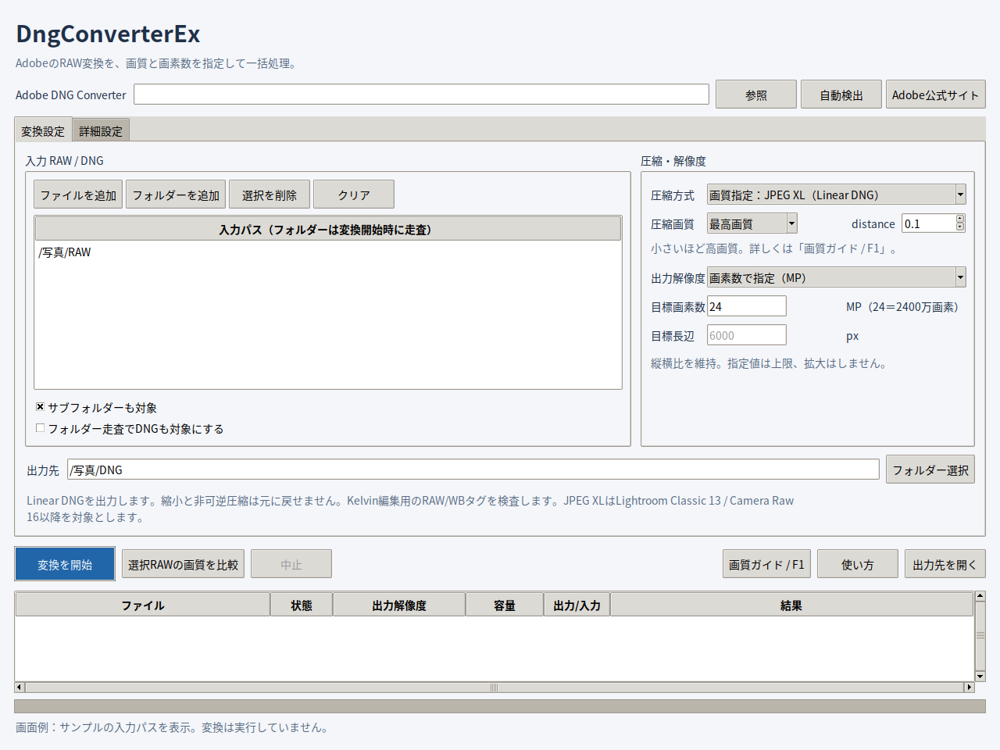
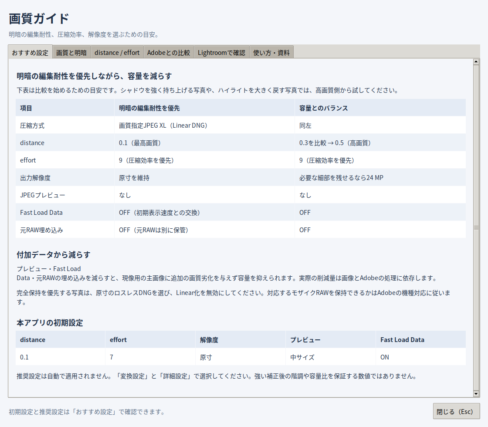
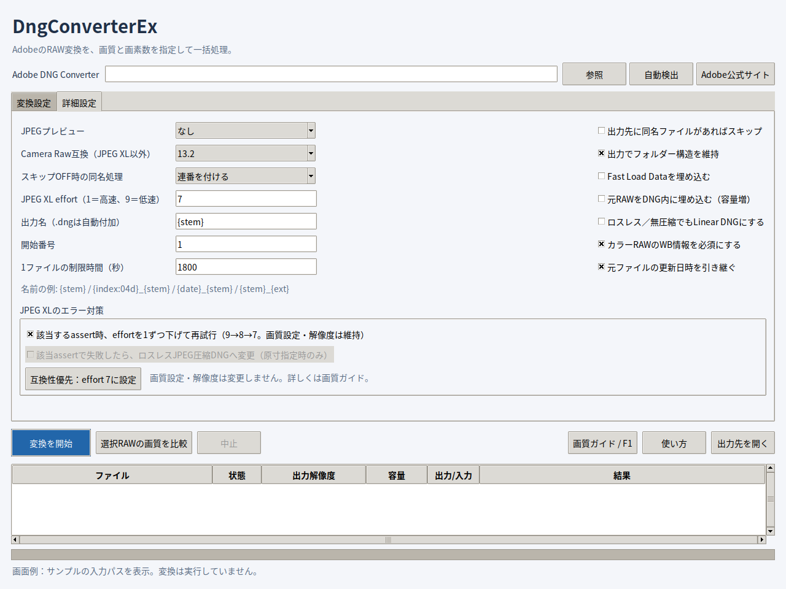
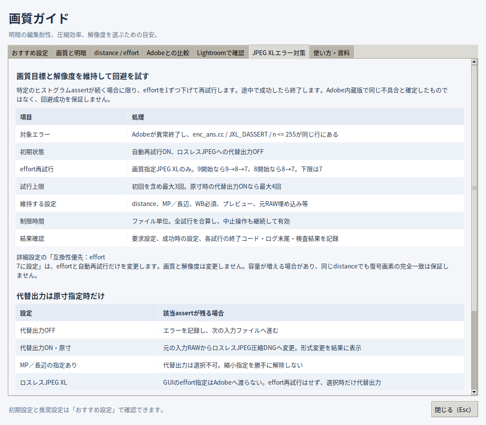

# DngConverterEx

圧縮画質と出力画素数を指定できる、PythonのデスクトップGUIです。
変換はインストール済みの **Adobe DNG Converter** が行います。
JPEG XLの圧縮画質・出力解像度を選び、Lightroomで編集するためのDNGを一括作成します。
Lightroomへの取り込みは手動です。Adobe公式アプリではなく、Python / Tkinterで作成した独立したフロントエンドです。
Adobe DNG Converterは、PhotoshopのAdobe Camera Rawプラグインとは別のアプリです。



*実際のTkinter画面をLinuxの仮想ディスプレイで撮影した設定例です。サンプルのパスを表示しています。変換結果や容量の実測を示すものではありません。Windows / macOSではフォント・外観が異なります。*

## 主な機能

- RAWファイル・フォルダーを追加して一括変換。機種対応はAdobe DNG Converterに従います。
- JPEG XLのdistance・effort、原寸・MP・長辺の指定。
- プレビュー、Fast Load Data、元RAW埋め込み、名前・同名処理の設定。
- 既存の出力ファイルをスキップするチェックボックス。設定を保存し、再実行時も使用できます。
- 複数のdistanceを比較するDNGを別フォルダーに出力。
- 元RAWの保護、中止・タイムアウト、失敗後の継続、結果レポート。
- 特定のJPEG XL assert時、画質・解像度を維持してeffortを1ずつ下げ、7まで再試行。原寸時だけ選択式の代替出力。
- **「画質ガイド / F1」から、明暗の編集耐性や設定の意味をオフラインで確認。**

| 動作条件 | 内容 |
|---|---|
| アプリ | 1.2.2 / Python 3.10以降、Tkinter |
| 変換を行うOS | Windows / macOS |
| JPEG XL変換の動作対象 | Adobe DNG Converter 16以降 |
| JPEG XL編集の動作対象 | Lightroom Classic 13以降 / Camera Raw 16以降 |
| 通常起動の追加pipパッケージ | 不要 |
| ライセンス | PythonフロントエンドはMIT。Adobe製品は別ライセンス |

このバージョンで実機検証が完了していない項目は、[検証状況](#検証自己レビュー)を参照してください。

## 起動

1. Python 3.10以降をインストール。Tkinterを含む公式Windows版を推奨します。
2. [Adobe DNG Converter](https://helpx.adobe.com/camera-raw/desktop/dng-and-file-formats/adobe-dng-converter.html) をインストール。
3. ZIPを展開し、Windowsでは **launch_windows.cmd** をダブルクリック。
4. RAWを追加し、出力先・圧縮画質・出力解像度を設定して「変換を開始」。

追加のPythonライブラリは不要です。Python関連付け済みなら **DngConverterEx.pyw** でも起動できます。
macOSではTkinterが使える環境で `python3 app.py`、または `launch_macos.command` を実行します。
Adobe公式コンバーターの対象OSはWindows / macOSです。LinuxのネイティブAdobe変換には対応しません。
Adobe実行ファイルとカメラプロファイルは同梱していません。

GitHubから取得した場合は、リポジトリのルートフォルダーで起動します。

```console
python app.py
```

初回は「自動検出」または「参照」でAdobe DNG Converterを指定してください。
設定はOSのユーザー設定フォルダーに保存します。[トラブルシューティング](#トラブルシューティング)に保存先を記載しています。

## アプリ内の画質ガイド

「画質ガイド / F1」で説明画面を開きます。「使い方」ボタンから操作手順のページも開けます。
ガイドは変換中も読めます。参考リンクを開く場合だけブラウザーを使用します。



| ページ | 説明 |
|---|---|
| おすすめ設定 | 明暗の編集耐性と容量を両立する出発点、初期設定との違い |
| 画質と明暗 | JPEGの階調損失、RAW由来のLinear DNG、縮小と圧縮の違い |
| distance / effort | 数字の意味、画質プリセット、処理時間と圧縮効率 |
| Adobeとの比較 | 公開SDKから読み取れる既定値の目安と、その適用範囲 |
| Lightroomで確認 | Kelvin入力、シャドウ・ハイライト・細部・容量の比較 |
| JPEG XLエラー対策 | 対象assert、effort再試行、原寸時の代替出力、制限と記録 |
| 使い方・資料 | 変換の手順、原本保護、公式資料へのリンク |

同じ内容を[画質ガイド](docs/QUALITY_GUIDE.md)でも読めます。
アプリと文書は同一の説明データから作成しています。

### 明暗の編集耐性を優先して容量を減らす

推奨値は実画像で比較するための出発点です。強い明暗補正後の同一性を保証する値ではありません。

| 項目 | 明暗の編集耐性を優先 | 容量とのバランス |
|---|---|---|
| 圧縮方式 | 画質指定JPEG XL（Linear DNG） | 同左 |
| distance | 0.1 | 0.3を比較してから0.5 |
| effort | 7（互換性を優先） | 7。安定動作を確認後に9を比較 |
| 解像度 | 原寸 | 細部の減少を許容するなら24 MP |
| JPEGプレビュー | なし | なし |
| Fast Load Data | OFF（初期表示速度との交換） | OFF |
| 元RAW埋め込み | OFF。原本は別に保管 | OFF |

プレビューなどの付加データを減らすと、現像用の主画像に追加の画質劣化を与えず容量を抑えられます。
完全保持を優先する場合は原寸ロスレスDNGを選び、Linear化を無効にしてください。
RAWの保持範囲はAdobeの機種対応に従います。

## 42MP → 24MP

GUIで下記を設定します。Adobeの処理で縦横比を維持して縮小します。

| 項目 | 設定例 |
|---|---|
| 圧縮方式 | 画質指定：JPEG XL（Linear DNG） |
| 圧縮画質 | 最高画質 |
| 出力解像度 | 画素数で指定（MP） |
| 目標画素数 | 24 |

24MPは24,000,000画素です。Adobeには `-count 24000000` を渡します。
MP、長辺px、原寸維持から選べます。指定値は上限で、元画像が小さい場合は拡大しません。
整数寸法への丸めがあるため、ちょうど24.000000MPになる保証はありません。
縮小時はデモザイク済みの **Linear DNG** になります。解像度を下げた画像は元RAWに対して不可逆です。
未現像モザイクを優先する場合は、原寸＋ロスレスを選びます。

## 圧縮方式

| モード | RAWデータ | 画質指定 | 縮小 |
|---|---|---|---|
| 画質指定JPEG XL（初期設定） | Linear RAW / DNG 1.7 | distance 0〜6 | MP / 長辺 |
| ロスレスJPEG | 原寸。モザイク保持はAdobeの機種対応に従う | 可逆圧縮 | 不可 |
| ロスレスJPEG XL | 原寸。AdobeのlosslessJXL処理 | 可逆圧縮 | 不可 |
| 非可逆JPEG | 旧版互換向けLinear RAW / DNG 1.6 | Adobe固定 | MP / 長辺 |
| 無圧縮 | Adobeの無圧縮DNG | 対象外 | 不可 |

JPEG XLは **Adobe DNG Converter 16以降、Lightroom Classic 13 / Camera Raw 16以降** を動作対象とします。
これは本アプリの保守的な対象設定で、厳密な最小対応バージョンではありません。
旧版Lightroom向けにはロスレスJPEG等を選び、詳細設定でCamera Raw互換を指定してください。
JPEG XLではDNG 1.7を使い、古いCamera Raw互換設定は適用しません。

### 圧縮画質

Adobe CLIのJPEG XL **distance** を直接指定します。小さいほど高画質です。
独自のJPEG品質パーセント換算は行いません。

| プリセット | distance |
|---|---:|
| 最高画質 | 0.1 |
| 高画質 | 0.5 |
| 標準 | 1.0 |
| 軽量 | 2.0 |
| 小容量 | 4.0 |
| 最小容量 | 6.0 |

カスタム値も入力できます。0はJPEG XL符号化段階のロスレス指定です。
ただし **Linear化・縮小は別の処理なので、distance=0でも元のモザイクRAWと同一にはなりません**。
effortは処理時間と圧縮効率の設定です。ロスレスJPEG XLはAdobeの固定effort 7を使用します。
大きいeffortは同じ画質目標で圧縮効率を高める方向です。必ず容量が減る、同じ復号画像になるという保証ではありません。
入力一覧でRAWを1つ選び、「選択RAWの画質を比較」を押すと、複数の画質のDNGを別フォルダーに出力します。
画質はLightroomで同じ現像設定にして比較してください。埋め込みJPEGプレビューだけでは判断できません。

## Lightroom・Kelvin編集

AdobeのRAW変換処理を使い、RAW用の色・撮影時WB・カメラ情報を持つDNGを生成する設計です。
出力のRAW IFD、色行列、AsShotNeutral / AsShotWhiteXYを検査します。
標準設定では、カラーRAWのWB情報が欠ける出力を失敗にします。JPEGからRAWを作る処理はありません。

**構造とWBタグの検査は、Lightroom上でKelvin操作ができることの実証ではありません。**
この開発環境にはAdobe DNG ConverterとLightroomがないため、実RAW変換・読み込み・Kelvin操作・実画質は未検証です。
Linear DNGはRAW用WB情報を持てますが、元のモザイクRAWと全機能が同一になる保証はありません。
Rawディテール等の強化機能、専用プロファイル、メーカー独自情報はAdobe側と出力形式の対応に依存します。
Lightroomカタログ内だけにある既存編集は、このアプリの読取対象ではありません。

最初は代表RAWを1枚変換し、Lightroomで以下を確認してください。

1. 読み込みと、色温度へのKelvin値入力。
2. 元RAWと同じプロファイル・WB・露光量での色や階調。
3. 出力の画素数と、100%表示での圧縮画質。

結果行をダブルクリックすると、実行コマンド・RAW種別・圧縮方式・寸法・WBタグを表示します。
検査は画像の復号や画像ダイジェスト検証を行いません。指定distanceがAdobe内部で使われたことも独立には証明しません。
モノクロRAWでは、詳細設定の「カラーRAWのWB情報を必須にする」を解除できます。

## 対応RAW

実際の機種対応はインストールされたAdobe DNG Converterと同じです。新機種ではConverterの更新が必要になる場合があります。
拡張子の選択対応は、そのメーカーの全機種・全記録モードへの対応を意味しません。

| メーカー例 | 主な拡張子例 |
|---|---|
| Canon | CR2 / CR3 / CRW |
| Nikon | NEF / NRW |
| Sony | ARW / SR2 / SRF |
| FUJIFILM | RAF |
| PENTAX | PEF / DNG |
| OM SYSTEM / Olympus | ORF |
| Panasonic | RW2 |
| Leica | DNG / RWL |
| Hasselblad / Phase One | 3FR / FFF / IIQ |
| Samsung / Sigma等 | SRW / X3F等。実際のAdobe対応機種のみ |

現像済みJPEG・PNG・一般的なTIFFをRAW代わりに入力する機能はありません。
DNGは直接追加できます。フォルダー走査では、再圧縮の混入を避けるため「DNGも対象」は初期状態で無効です。
既に非可逆圧縮されたDNGを再圧縮すると、追加の画質劣化が起こり得ます。

## 一括処理

入力RAWを削除・変更しません。変換は別スレッドから1ファイルずつAdobeプロセスを実行します。
一時フォルダーで変換・検査してから、出力を確定します。
未対応、破損、出力なし、圧縮／解像度指定の無視はエラーとして記録し、次のファイルに進みます。
中止・タイムアウトでは実行中のプロセスを停止し、未完了の一時DNGを破棄します。完了済みDNGは残します。
初期設定の同名処理は連番付加です。詳細設定の「出力先に同名ファイルがあればスキップ」で、既存出力がある入力の変換を省略できます。入力DNGへの上書きは禁止です。

| スキップのチェック | 同名ファイルがある場合 |
|---|---|
| ON | 変換を開始せずスキップし、次の入力へ進む。既存ファイルを保持 |
| OFF（初期状態） | 「スキップOFF時の同名処理」で選んだ連番付加／上書きを使用 |

チェック状態は次回起動時にも復元します。ONの間は同名処理欄を無効化し、OFFに戻すと以前の選択を使用します。
旧版で同名処理に「スキップ」を選んでいた場合も、チェックONとして引き継ぎます。
変換中に同名出力が作成された場合も、ONならそのファイルを置き換えずスキップします。
同一バッチ内の名前衝突には、上書き設定でも連番を付けます。
サブフォルダー走査、フォルダー構造維持、名前・開始番号を設定できます。

出力先に `conversion_report_日時_識別子.jsonl` を保存します。絶対パス、圧縮、寸法、実行引数、エラーを含みます。
画像をネット送信する処理はありません。「Adobe公式サイト」と画質ガイドの参考リンクはブラウザーで開きます。
Windowsのrename / POSIXのhard linkで確定します。hard link非対応時は既存ファイルを上書きしない排他的コピーを使います。

## 詳細設定・機能範囲

プレビュー、Fast Load Data、元RAW埋め込み、Linear化、互換バージョン、名前、制限時間を指定できます。
元RAW埋め込みは容量を増やします。埋め込んだRAWの抽出はAdobe側で行ってください。
Adobe GUIの全補助機能を再実装したものではなく、公開CLIの変換機能を中心としたフロントエンドです。
プレビューなどの挙動はAdobeのバージョンに依存します。



### JPEG XLのヒストグラムassertを回避する

詳細設定の「JPEG XLのエラー対策」で選択します。初期状態はeffort再試行ON、代替出力OFFです。
distanceと出力解像度を変えず、圧縮効率の設定だけを下げて回避を試します。

| 項目 | 動作 |
|---|---|
| 対象 | Adobeの異常終了と、同じ行の `enc_ans.cc`・`JXL_DASSERT`・`n <= 255` が一致 |
| 自動再試行 | 画質指定JPEG XLのみ。対象assertが続く場合に1ずつ下げ、成功した時点で終了 |
| 再試行順 | 9開始：9→8→7。8開始：8→7。下限は7 |
| 互換性優先ボタン | effortを7、自動再試行をONに設定。画質・解像度は変更しない |
| 代替出力 | 選択した場合だけ、該当assertが残る入力を元RAWからロスレスJPEG圧縮DNGへ変更 |
| 縮小指定あり | 代替出力は選択不可。指定MP／長辺を勝手に解除しない |
| ロスレスJPEG XL | GUIのeffort値は渡らないためeffort再試行なし。選択した場合だけ代替出力 |
| 試行上限 | 初回＋effort再試行で最大3回。原寸時の選択式代替出力を含め最大4回。制限時間は全試行の合計 |
| 結果・レポート | 要求設定、成功時の設定、各試行のコマンド・終了コード・ログ末尾（最大16,000バイト相当）を記録 |

各試行には別のAdobeプロセスと一時出力フォルダーを使います。失敗時の途中DNGは採用せず、出力検査に成功してから保存します。
無関係なエラー、検査失敗、中止、タイムアウトを理由に再試行や代替出力は行いません。
旧方式の非可逆JPEGへの自動変更も行いません。



[libjxl #3890](https://github.com/libjxl/libjxl/issues/3890)は16bit単色・可逆圧縮・effort 8以上の報告です。
Adobe内蔵版・非可逆DNGで同じ不具合か、effort 7で回避できるかは未確認です。
同じdistanceでも復号画素の完全一致やファイルサイズは保証しません。effort 5は、7でも失敗する場合の手動試験候補です。
根本対処には[修正 #3897](https://github.com/libjxl/libjxl/pull/3897)を含むAdobe版が必要で、Pythonパッケージ更新だけでは直りません。
Adobeへの修正取り込み状況は未確認です。

| 名前の項目 | 意味 |
|---|---|
| `{stem}` | 元の名前（拡張子なし） |
| `{ext}` | 元RAWの拡張子、大文字 |
| `{index:04d}` | 4桁連番 |
| `{date}` | 元ファイルの更新日。EXIF撮影日ではない |

## 任意のCLI

アプリフォルダーで実行します。GUI専用EXEではなくPythonからCLIを使います。

```console
python app.py
python app.py doctor
python app.py convert "D:\RAW" --output "D:\DNG" --mp 24 --distance 0.1
python app.py convert "D:\RAW" --output "D:\DNG" --mode lossless-jpeg
python app.py compare "D:\RAW\photo.ARW" --output "D:\compare" --mp 24 --distances 0.1,0.3,0.5 --effort 7
python app.py convert "D:\RAW" --output "D:\DNG" --effort 9 --jxl-fallback
python app.py inspect "D:\DNG\photo.dng"
python app.py convert "D:\RAW\photo.NEF" --output "D:\DNG" --mp 24 --dry-run
```

Adobe実行ファイルは `--converter` または環境変数 `ADOBE_DNG_CONVERTER` でも指定できます。
CLIでの中止はCtrl+Cです。
`--no-jxl-retry`でeffort再試行を無効化できます。`--jxl-fallback`は原寸指定時だけ使用できます。

## Windows用EXEを作る

**build_windows_exe.cmd** はPyInstallerをインストールして、GUI用の `dist\DngConverterEx\DngConverterEx.exe` を作ります。
配布する場合は `dist\DngConverterEx` フォルダー全体を渡してください。Adobeは使用PCにも別途必要です。
このZIPにはビルド済みEXEを含みません。EXEビルドも本環境では未検証です。

## トラブルシューティング

| 症状 | 確認すること |
|---|---|
| Adobe実行ファイルを検出できない | 公式コンバーターをインストールし、参照またはパス入力で指定。`python app.py doctor`で環境を確認 |
| `No module named tkinter` | Tkinterを含むPythonを使用。OS用のTk / Tkinterを追加 |
| 画質・MPの指定が使えない | 縮小と画質指定には「画質指定JPEG XL」を選択 |
| LightroomがDNGを読めない | バージョンと機種対応を確認。古い環境ではロスレスJPEGと適切なCamera Raw互換を選択 |
| 元RAWより容量が大きい | Linear化、低いdistance、ノイズ、プレビュー・RAW埋め込みを確認。縮小・非可逆でも小さくなる保証はない |
| `enc_ans.cc:... JXL_DASSERT: n <= 255` | effort 7を優先。詳細設定の限定再試行、原寸時の選択式代替出力を確認。Adobe内蔵版での根本修正は未確認 |
| WB情報不足でエラー | まずカラーRAWと機種対応を確認。モノクロRAWではWB必須の設定を解除できる |
| 表示できるが色や階調が違う | RAWとDNGのプロファイル・WB・解像度・現像設定を揃える。プレビューだけで判断しない |

| 設定ファイル | 保存先 |
|---|---|
| Windows | `%APPDATA%\DngConverterEx\settings.json` |
| macOS | `~/Library/Application Support/DngConverterEx/settings.json` |
| Linux（GUI表示・開発のみ） | `$XDG_CONFIG_HOME/DngConverterEx/settings.json`、未設定なら `~/.config/DngConverterEx/settings.json` |

アプリを閉じて設定ファイルを別の名前にすると、次の起動で初期設定に戻せます。
不具合の報告では、アプリ・OS・Python・Adobe・Lightroomのバージョン、カメラ機種、設定とエラーを記載してください。
変換レポートには絶対パスが含まれるため、公開する前に個人情報を確認してください。

## 検証・自己レビュー

```console
python -m unittest discover -s tests -v
```

| 確認対象 | 状態 |
|---|---|
| MP引数、TIFF / BigTIFF / 両バイト順 / RAW SubIFD | 自動テスト通過 |
| 原本保護・同名衝突・既存出力のスキップ・日本語パス | 模擬コンバーターで確認 |
| 破損・WB欠落・指定無視の拒否 | 模擬コンバーターで確認 |
| 中止・タイムアウト・エラー後継続 | 模擬コンバーターで確認 |
| assertの限定再試行・代替出力・設定記録・部分出力破棄 | 模擬コンバーターで確認 |
| 実RAW変換・実画質・Lightroom・Kelvin操作 | 未検証 |
| GUI表示・画質ガイドの開閉と各ページ・スクロール | Linux仮想ディスプレイで確認 |
| Windows / macOS実行・EXEビルド | 未検証 |

35件のテストが通過しています。合成DNGの圧縮ペイロードはダミーで、画像の正しさを検証するテストではありません。
実機検証が残るため、全機種・Lightroom互換・実画質を検証済みとは扱っていません。

検証の詳細は[VALIDATION.json](VALIDATION.json)、開発・スクリーンショット再生成は[CONTRIBUTING.md](CONTRIBUTING.md)、変更点は[CHANGELOG.md](CHANGELOG.md)を参照してください。

## ソースコードと開発

[GitHubリポジトリ](https://github.com/torowasa-dev/dng_converter_ex) の **Code → Download ZIP** から取得し、展開して起動できます。Gitを使う場合は以下を実行してください。

```console
git clone https://github.com/torowasa-dev/dng_converter_ex.git
cd dng_converter_ex
python app.py
```

READMEから参照する実画面の画像はすべて相対パスで同梱しています。
開発手順は[CONTRIBUTING.md](CONTRIBUTING.md)を参照してください。
Adobeの実行ファイル、カメラプロファイル、撮影RAW、ローカル設定はリポジトリに追加しないでください。

[GitHub Actions](https://github.com/torowasa-dev/dng_converter_ex/actions)でPythonのテストと画質ガイドの文書整合性を確認します。合成メタデータと模擬変換のテストであり、Adobe・Lightroomとの実機互換を保証するCIではありません。

## Adobe資料

- [DNG Converter](https://helpx.adobe.com/camera-raw/desktop/dng-and-file-formats/adobe-dng-converter.html)
- [DNG仕様・SDK・CLI仕様](https://helpx.adobe.com/camera-raw/desktop/dng-and-file-formats/digital-negative.html)
- [Adobe CLI資料PDF](https://helpx.adobe.com/content/dam/help/en/camera-raw/digital-negative/jcr_content/root/content/flex/items/position/position-par/download_section/download-1/dng_converter_commandline.pdf)
- [Lightroomの色温度／Kelvin](https://helpx.adobe.com/jp/lightroom-classic/desktop/process-and-develop-photos/image-tone-color.html)
- [libjxlのdistance・effort](https://libjxl.readthedocs.io/en/latest/api_encoder.html)
- [Adobe SDKのJPEG XL既定値実装](https://android.googlesource.com/platform/external/dng_sdk/%2B/68764928faa1d15f76bbf8f03c6e630c570a4354/source/dng_host.cpp)

公開CLIの `-lossy`, `-count`, `-side`, `-jxl_distance`, `-jxl_effort`, `-losslessJXL`, `-p`, `-fl`, `-e`, `-cr`, `-d`, `-o` を使用します。
PDFはAdobe側の移転により取得できない場合があります。その場合はDNG公式ページのCLI仕様を参照してください。

SDKの既定値は、参照コミットの処理条件から読み取った目安です。現在のConverter GUIの既定出力を実測した値ではありません。

## ライセンス

[MIT License](LICENSE.txt)は本リポジトリのPythonフロントエンドとテストに適用します。
Adobe DNG Converter、Lightroom、カメラプロファイルは同梱せず、それぞれの提供元のライセンスに従います。
Adobe・Lightroom等の名称は各権利者の商標です。

This product includes DNG technology under license by Adobe.
